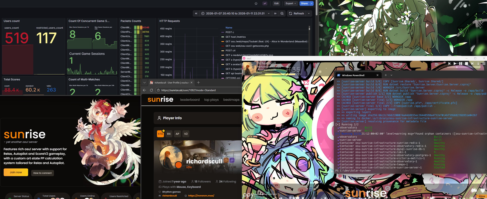

<p align="center">
  
</p>

[](https://opensource.org/licenses/MIT)
[](https://github.com/himejoshi-gay/Apollo)

Monorepo with all the services needed to run a instance of Himejoshi

## Description 📖

Apollo is a **monorepo** containing all the essential components required to run a complete Himejoshi server stack. Each major piece is managed as a submodule within this repository, allowing you to orchestrate, develop, and deploy everything together with ease.

## Preview 🖼️



## Components 🧩

- [x] [**🌸 Himejoshi (Server Core)**](https://github.com/himejoshi-gay/Himejoshi)  
  The main server backend, handling core game logic and API for osu! servers.

- [x] [**🌕 Moonlight (Frontend)**](https://github.com/himejoshi-gay/Moonlight)  
  The frontend web interface of Himejoshi. Allows to browse profiles, leaderboards, multiplayer lobbies, and manage users/beatmaps using admin panel.

- [x]  [**🔭 Observatory (Beatmap Manager)**](https://github.com/himejoshi-gay/Observatory)  
  Powerful "on demand" beatmap manager which uses osu!'s API and popular beatmap mirrors to prioritize speed and efficiency. Used by Himejoshi to fetch beatmaps and calculate performance points.

- [x] [**✨ asteriaAI (Discord Bot)**](https://github.com/himejoshi-gay/asteriaAI)  
  A Discord bot that integrates directly with your Himejoshi server, delivering community features and server utilities directly into your Discord server.

Before you begin, ensure you have the following installed:

- [**Git**](https://git-scm.com/)
- [**Docker** and **Docker Compose**](https://www.docker.com/get-started/)
- Basic knowledge of command line stuff

### Installation Steps

1. **Clone the repository with submodules:**

   ```console
   git clone --recursive https://github.com/himejoshi-gay/Apollo.git
   cd Apollo
   ```

   Or if you've already cloned without submodules, inside the folder:

   ```console
   git submodule update --init --recursive --remote
   ```

2. **Set up configuration files:**
   
   Create copies of the example configuration files:
   
   ```console
   cp .env.example .env
   cp Himejoshi.Config.Production.json.example Himejoshi.Config.Production.json
   ```
   
   Fill in the required parameters in both files.
   
  > [!IMPORTANT]
  > Make sure to edit `WEB_DOMAIN=` in `.env` to your actual domain that you plan to host on.
   
  > [!TIP]
  > You can customize the configuration files to match your requirements. For example, in `Himejoshi.Config.Production.json`, you can change the bot username:
  > ```json
  > "Bot": {
  >   "Username": "asteriaAI",
  >   ...
  > }
  > ```

3. **Generate API keys:**
   
   Generate the token secret for Himejoshi API requests:
   
   ```console
   chmod +x lib/scripts/generate-api-himejoshi-key.sh
   ./lib/scripts/generate-api-himejoshi-key.sh
   ```

   This will generate a token for Himejoshi API requests.
   
   Generate the Observatory API key (allows Himejoshi to request Observatory without internal rate limits):
   
   ```console
   chmod +x lib/scripts/generate-observatory-api-key.sh
   ./lib/scripts/generate-observatory-api-key.sh
   ```
   
  > [!TIP]
  > You will be prompted to run multiple `.sh` scripts during setup, if you are using **Windows**, please use `.bat` equivalent scripts located in the same folder.
   

4. **Start the server:**
   
   ```console
   chmod +x ./start.sh
   ./start.sh
   ```
   
   This should start the server without any problems.

5. **Verify the server is running:**
   
   You can check that all containers are running with:
   
   ```console
   docker ps
   ```
   
   You should see containers for Himejoshi server, Himejoshi website, Observatory, Himejoshi Discord bot, and supporting services (PostgreSQL, Redis, Grafana, etc.) all running.

> [!NOTE]
> For more in-depth documentation with detailed setup instructions, visit [the documentation](https://docs.himejoshi.gay/).

> [!TIP]
> Join our [Discord server](https://discord.gg/himejoshi) if you have any questions or just want to chill with us!

### Hosting on the Internet 🌐

To make your server accessible on the internet:

1. **Configure DNS records:**
   
   Make sure you have DNS records pointing the following subdomains to your server's IP address:
   
   - `*` (wildcard)
   - `api`
   - `osu`
   - `a`
   - `c`
   - `assets`
   - `cho`
   - `c4`
   - `b`
   - `grafana`
   
   These subdomains are required for the server to function properly.

2. **Start Caddy reverse proxy:**
   
   For simplicity, we use Caddy as a reverse proxy. By default, the `Caddyfile` is configured to host the website, server, and Grafana. You can uncomment additional configurations in the `Caddyfile` if needed.

   Start Caddy by running:
   
   ```console
   sudo caddy start --envfile .env
   ```
   
   Your server should now be up and accessible!

  > [!IMPORTANT]
  > If you are intending to use **Grafana** for monitoring, make sure to uncomment the Grafana section in the `Caddyfile` before starting Caddy.
  > After starting Caddy, make sure to visit `grafana.*` subdomain and change the default password for the admin account!

## Contributing 💖

If you want to contribute to the project, feel free to fork the repository and submit a pull request. We are open to any
suggestions and improvements.
